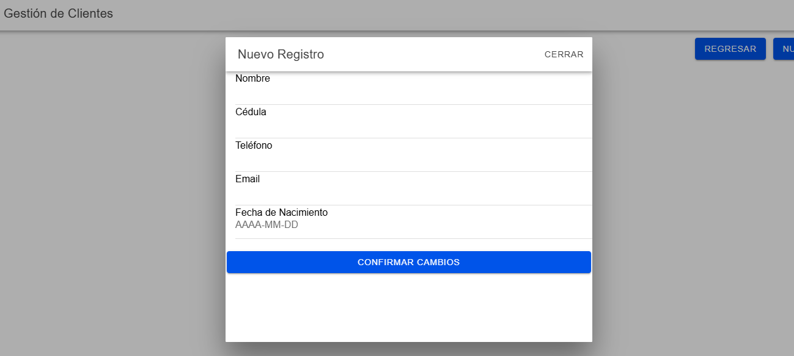
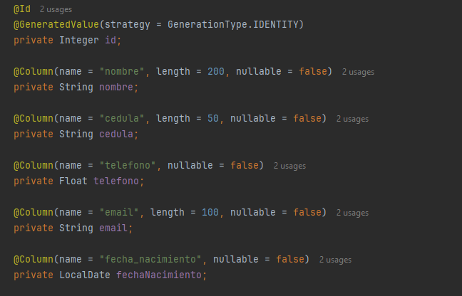
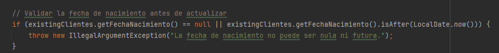

# Parcial III

En el parcial, el estudiante debe demostrar su capacidad para manipular de manera adecuada el código fuente del proyecto, comprendiendo su estructura y funcionamiento. Deberá ser capaz de agregar nuevas funcionalidades en tiempo real, utilizando el código fuente ya construido como base. Esto incluye implementar mejoras funcionales o visuales en la aplicación, asegurando que los cambios realizados sean efectivos y no comprometan el rendimiento o la estabilidad del sistema. Como parte de la evaluación, el estudiante debe compartir el enlace al repositorio de GitHub del proyecto. Este repositorio debe incluir:

  
- El backend: Código y configuraciones necesarias para gestionar la lógica del servidor y las interacciones con la base de datos.
- El frontend: Interfaz de usuario completamente funcional, que refleje las mejoras y cambios implementados.
- La presentación: Documentación o recursos visuales que expliquen las características del proyecto, las mejoras realizadas y cómo se integraron.
- El archivo APK ya compilado: La versión ejecutable de la aplicación para dispositivos móviles, que incorpore todas las funcionalidades mejoradas.
- El repositorio debe estar organizado de manera clara, con instrucciones en el archivo README que expliquen cómo clonar, instalar y ejecutar el proyecto, tanto en su versión de desarrollo como en su versión final.

- Jersson Buitrago => Cliente => fecha nacimiento

# **Biblioteca Atena**

Sistema de gestión para la Biblioteca Atena, diseñado como una solución de software que permite administrar clientes, recursos y funcionalidades de la biblioteca mediante una arquitectura distribuida que incluye frontend (Ionic/Vue.js), backend (Spring Boot) y base de datos.

---

## **Estructura del Proyecto**

El proyecto está organizado de la siguiente manera:

- **`FrontendAtena`**: Aplicación frontend desarrollada con **Ionic** y **Vue.js**.
- **`BackendAtena`**: API REST desarrollada con **Spring Boot** para gestionar las operaciones del backend y la comunicación con la base de datos.
- **`DatabaseAtena`**: Archivos de configuración relacionados con la base de datos, como `docker-compose.yml` para el contenedor de la base de datos.
- **`APK`**: Carpeta con el archivo `app-debug.apk` generado para Android.

---

## **Nuevo Atributo: Fecha de Nacimiento**

El atributo **`fechaNacimiento`** fue añadido al modelo `Clientes` para registrar la fecha de nacimiento de cada cliente en formato **`AAAA-MM-DD`**. Este atributo es fundamental para realizar un seguimiento más detallado de los datos personales de los clientes. A continuación, se detalla cómo fue integrado en el **backend** y en el **frontend**.

---

### **Backend**

1. **Entidad `Clientes`:**
   En el backend, el atributo `fechaNacimiento` fue agregado a la clase de entidad `Clientes` como una columna de la base de datos. Se configuró de la siguiente manera:
   ```java
   @Column(name = "fecha_nacimiento", nullable = false)
   private LocalDate fechaNacimiento;

### **Cambios realizados:**
1. **Frontend**: Se agregó un campo en el formulario para capturar la fecha de nacimiento.
   
   **Evidencia:**
   
   
2. **Backend**:
   - Se incluyó el atributo `fechaNacimiento` en la entidad `Clientes`.
   - Se validó que este campo no sea nulo al momento de realizar una operación de inserción o actualización.
  
**Entity:**
  
  

  **Service:**

  


## **Requisitos Previos**

Asegúrate de tener instalados los siguientes programas en tu sistema:

1. **Node.js** (versión 16 o superior)  
   [Descargar Node.js](https://nodejs.org)  
2. **Java** (JDK 17 o superior)  
   [Descargar JDK](https://www.oracle.com/java/technologies/javase-jdk17-downloads.html)  
3. **MySQL** (o Docker para la base de datos)  
   [Descargar MySQL](https://dev.mysql.com/downloads/)  
4. **Maven**  
   [Instalar Maven](https://maven.apache.org/install.html)  
5. **Ionic CLI** (para ejecutar el frontend):  
   ```bash
   npm install -g @ionic/cli```
6. **Docker** si prefieres ejecutar la base de datos en un contenedor)
Descargar Docker: [Descargar Docker](https://docs.docker.com/get-docker/)


